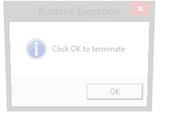

# CATIA V5 Runtime Exception

> Click OK to terminate

## About
Fake CATIA V5 runtime exception message generator. Your favorite CATIA V5 feature, whenever you want !


## Usage
1. Start `RuntimeException.exe`
2. Enjoy
3. Repeat

You don't need CATIA V5 to run the `RuntimeException.exe` program.  
Fully portable, no admin rights / setup needed.

If you want to edit or deactivate the dialog box message, just edit the `RuntimeException.exe.config` file :

```xml
<applicationSettings>
	<RuntimeException.My.MySettings>
		<setting name="MsgBoxText" serializeAs="String">
			<value>Click OK to terminate</value>
		</setting>
		<setting name="ShowAdditionalMsgBox" serializeAs="String">
			<value>True</value>
		</setting>
		<setting name="AdditionalMsgBoxText" serializeAs="String">
			<value>OOPS ! April fool's joke !</value>
		</setting>
	</RuntimeException.My.MySettings>
</applicationSettings>
```



## Requirements
- Microsoft [.NET Framework 4](https://www.microsoft.com/en-US/download/details.aspx?id=17851)
- Microsoft Windows Vista or later

## License
CATIA V5 Runtime Exception is released under the [Unlicense](http://unlicense.org).